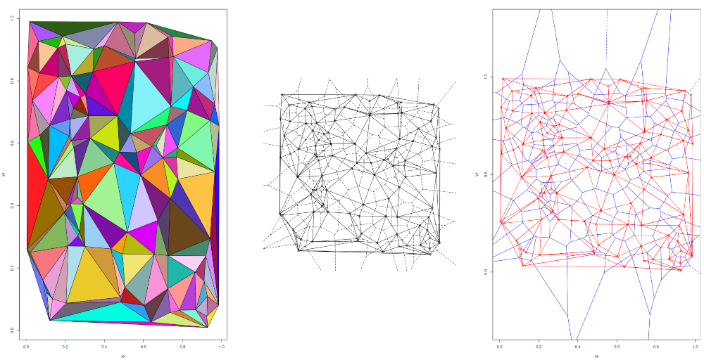

<h2>Voronoi Tessellation and Delaunay Triangulation By Fortune's Algorithm</h2>

**voronoifortune** is an R port of a program written in C by [Steven Fortune](https://9p.io/who/sjf/). It performs Voronoi tessellation and Delaunay triangulation using a very efficient algorithm described in:

>Fortune, S. (1987) A sweepline algorithm for Voronoi diagrams. *Algorithmica* **2:** 153-174. Doi:[`10.1007/BF01840357`](https://doi.org/10.1007/BF01840357).

Two main changes were made to the original C code:

1. All real numbers are now coded as double precision instead of single precision.
2. The data are now passed to and returned from R (no files are written/read).

<h3>Installation and Usage</h3>

The package should be easy to install giving R and a C compiler (i.e., standard install from sources of an R package).

The main function is named `voronoi()` and takes as main argument a matrix with two columns giving the $x$ and $y$ coordinates. There are two options:

- `sorted = FALSE`: if the coordinates are already sorted in increasing order *first* by $y$, *then* by $x$ (see `?order` in R).
- `debug = FALSE`: if `debug = TRUE` (very) verbose of the computation details are printed.

The returned list has four elements:

- `Triplets`: the triangles of the Delaunay triangulation;
- `Vertices`: the vertices of the Voronoi tessellation;
- `Edges`: the edges (or segments) of the tessellation;
- `Lines`: a description of the previous segments (some of them are semi-infinite).

There are a `print()` and a `plot()` methods to display the results.

<h3>Comparison With Other Packages</h3>

I found two packages performing similar operations on CRAN: [deldir](https://cran.r-project.org/package=deldir) and [tessellation](https://cran.r-project.org/package=tessellation).

First, these packages do not have the same functionalities: the present one considers only 2-D data, whereas **tessellation** can do tessellation in 3-D.

Second, Fortune's algorithm is much faster than the algorithms implemented in the two other packages. Next is an example with 1000 points:

```r
R> library(deldir)
deldir 0.1-25
R> library(tessellation)
R> library(voronoifortune)

Attachement du package : ‘voronoi’

L'objet suivant est masqué depuis ‘package:tessellation’:

    voronoi
```

We note that **tessellation** has also a function named `voronoi()`, but since the present package was loaded after, we don't need to call it with the namespace operator. In case of doubt, `voronoifortune::voronoi()` and `tessellation::voronoi()` can be used.

```r
R> n <- 1000L
R> xx <- runif(n)
R> yy <- runif(n)
R> X <- cbind(xx, yy)
R> system.time(res <- voronoi(X))
utilisateur     système      écoulé
      0.001       0.000       0.001
R> system.time(dd <- deldir(xx, yy))
utilisateur     système      écoulé
       0.03        0.00        0.03
R> system.time(del <- delaunay(X))
utilisateur     système      écoulé
      0.359       0.003       0.365

```

Fortune's algorithm has been reported to scale with $O(n)$ which seems to be true in practice:


```r
R> n <- 1e4L
R> xx <- runif(n)
R> yy <- runif(n)
R> system.time(res <- voronoi(X))
utilisateur     système      écoulé
      0.010       0.001       0.012
R> system.time(dd <- deldir(xx, yy))
utilisateur     système      écoulé
      2.103       0.014       2.125
R> system.time(del <- delaunay(X))
utilisateur     système      écoulé
      7.948       0.383       8.369
```

The results seem identical for all functions. Here's an example with `n <- 100` and the default plotting parameters of each package (from left to right: **tessellation**, **deldir**, **voronoifortune**):

```r
R> layout(matrix(1:3, 1))
R> plotDelaunay2D(del)
R> plot(dd)
R> plot(res)
```



<h3>TODO</h3>

- ~~The Delaunay triangulation returned by `voronoi::voronoi()` often misses some edges at the periphery of the points: these edges can easily be found with a convex hull (`hull()` in R). This will be fixed later.~~ This was a bug in the R code. The plots are now fine.
- ~~Some memory leaks might still be need to be fixed from the original C code.~~ The original C code did not call `free()`; this was fixed by replacing `malloc()` by `R_alloc()`.
- ~~Prepare the package for a submission to CRAN.~~ Now on CRAN.
